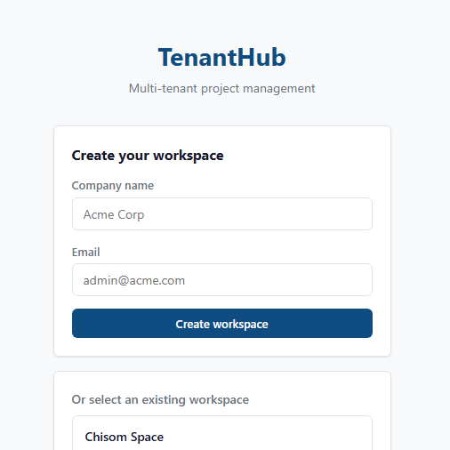

# TenantHub

Multi-tenant project management SaaS with Paystack payment integration.
Built for the AWS DevOps Bootcamp by Spice Technologies.

```
tenanthub/
├── api/          # Node.js backend  →  ECS Fargate (production)
├── frontend/     # Static HTML/JS   →  S3 + CloudFront (production)
└── docker-compose.yml
```

---

## Prerequisites

| Tool | Download |
|------|----------|
| Docker Desktop | https://www.docker.com/products/docker-desktop |
| Git | https://git-scm.com |

Verify:

```bash
docker --version
docker compose version
```

---

## Run Locally

### 1. Clone

```bash
git clone https://github.com/YOUR_ORG/tenanthub.git
cd tenanthub
```

### 2. Configure environment

```bash
cp .env.example .env
```

Open [.env](.env) and fill in your values:

```env
AWS_ACCESS_KEY_ID=your_key_here
AWS_SECRET_ACCESS_KEY=your_secret_here
AWS_REGION=us-east-1
PAYSTACK_SECRET_KEY=sk_test_your_key_here
```

> Need AWS keys? See [DEPLOYMENT.md](DEPLOYMENT.md) — steps 1–2 walk you through creating an IAM user and getting keys.

### 3. Start

```bash
docker compose up --build
```



| Service | URL |
|---------|-----|
| Frontend | http://localhost:3000 |
| API | http://localhost:8080 |
| Health check | http://localhost:8080/health |

### Useful commands

```bash
docker compose up --build -d   # run in background
docker compose logs -f         # stream logs
docker compose logs -f api     # api logs only
docker compose down            # stop everything
```

### Paystack test card

```
Card   : 4084 0840 8408 4081
Expiry : any future date
CVV    : 408
```

---

## Deploying to AWS

See [DEPLOYMENT.md](DEPLOYMENT.md) for the full guide:
- Create IAM user and configure AWS CLI
- Create DynamoDB tables, SSM parameters, Secrets Manager secret
- Push image to ECR and deploy to ECS Fargate

---

## API Reference

| Method | Endpoint | Description |
|--------|----------|-------------|
| GET | /health | Health check |
| POST | /api/tenants | Create tenant |
| GET | /api/tenants | List tenants |
| GET | /api/tenants/:id | Get tenant |
| POST | /api/projects | Create project |
| GET | /api/projects/tenant/:id | List tenant projects |
| DELETE | /api/projects/:tid/:pid | Delete project |
| POST | /api/tasks | Create task |
| GET | /api/tasks/project/:id | List project tasks |
| PATCH | /api/tasks/:pid/:tid | Update task status |
| DELETE | /api/tasks/:pid/:tid | Delete task |
| POST | /api/payments/initialize | Start Paystack payment |
| GET | /api/payments/verify/:ref | Verify transaction |
| POST | /api/payments/webhook | Paystack webhook |
| GET | /api/payments/tenant/:id | List tenant payments |
